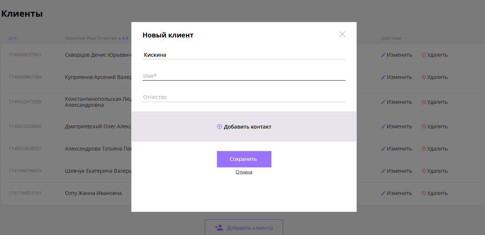

# Frontend Module

## Description

This project represents the frontend part of the application with the following functionality:
- User authentication and authorization
- Dashboard with real-time data visualization
- Responsive design for mobile and desktop
- Integration with backend API for data fetching and manipulation
- Data editing
- Data sorting and searching
- Modal window animations
- Hash and hashchange functionality
- Form validation before submitting to the server
- Loading indicators
- BEM (Block Element Modifier) methodology for CSS class naming

## Installation

1. Clone the repository:
   ```sh
   git clone https://github.com/EkaterinaSevciuc/frontend-module.git
   ```

2. Navigate to the project directory:
   ```sh
   cd frontend-module
   ```

## Usage

1. Open the `index.html` file in your browser.

## Examples

- Example 1: User login and registration
- Example 2: Viewing and interacting with the dashboard

## Screenshots

 


## Contributing

If you would like to contribute to this project, please follow these steps:
1. Fork the repository.
2. Create a new branch (`git checkout -b feature-branch`).
3. Make your changes and commit them (`git commit -m 'Add new feature'`).
4. Push to the branch (`git push origin feature-branch`).
5. Create a new Pull Request.

## License

This project is licensed under the [MIT License](LICENSE).
